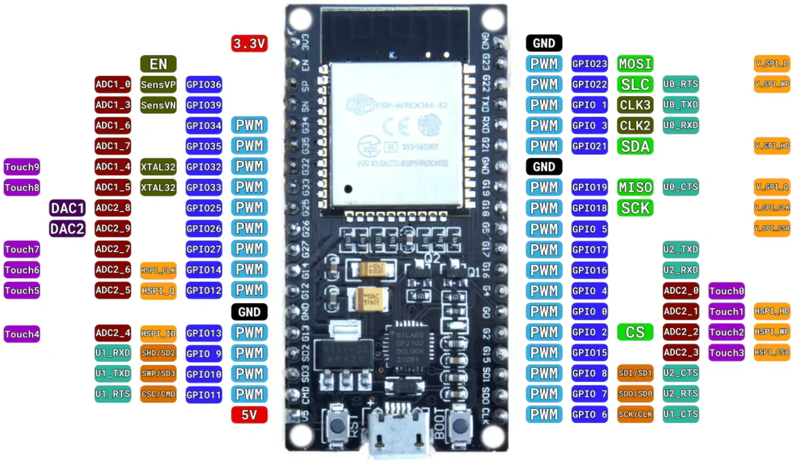

## ¿Qué es Espressif?

**Espressif Systems** es una empresa de semiconductores reconocida por sus microcontroladores de bajo costo y alto rendimiento, como el **ESP8266**, **ESP32** y sus versiones más recientes. Estos chips incluyen conectividad **Wi-Fi**, **Bluetooth** y **BLE**, lo que los hace ideales para aplicaciones de **Internet de las Cosas (IoT)**, domótica, automatización, y sistemas embebidos en general.

## ¿Por qué es importante aprender sobre Espressif?

- ✅ **Conectividad integrada**: No se necesita hardware adicional para conectarse a Wi-Fi o Bluetooth.
- 💰 **Bajo costo**: Son accesibles para estudiantes, makers y desarrolladores.
- 🧠 **Comunidad activa**: Existe abundante documentación, ejemplos y soporte.
- 🔧 **Versatilidad en programación**: Se pueden programar usando C/C++ con frameworks como **Arduino**, **ESP-IDF**, o entornos como **PlatformIO**.
- 🌎 **Aplicaciones reales**: Se utilizan en productos comerciales y soluciones IoT del mundo real.

## Sobre este repositorio

Este repositorio está diseñado para **estudiantes de física**, con el objetivo de:

- Facilitar el aprendizaje práctico de microcontroladores modernos.
- Aplicar conceptos de física a través de proyectos electrónicos e interactivos.
- Desarrollar habilidades en instrumentación, adquisición de datos y automatización.
- Explorar el uso de sensores, actuadores y comunicación inalámbrica en experimentos de laboratorio o proyectos personales.

Usamos el entorno de desarrollo **PlatformIO** por su integración moderna con **Visual Studio Code**, su gestión de dependencias y soporte para múltiples plataformas, incluyendo todos los dispositivos de la familia **ESP32**.

## Microcontrolador utilizado


## Pinout de referencia




## Instalación de Visual Studio Code y PlatformIO

### 1. Instalar Visual Studio Code

- Descargar desde el sitio oficial: [https://code.visualstudio.com/](https://code.visualstudio.com/)
- Disponible para **Windows**, **macOS** y **Linux**.
- Instalar como cualquier otra aplicación.

### 2. Instalar PlatformIO en Visual Studio Code

1. Abrir Visual Studio Code.
2. Ir a la pestaña de **Extensiones** (icono de cuadrados en la barra lateral izquierda o presionar `Ctrl+Shift+X`).
3. Buscar `PlatformIO IDE`.
4. Hacer clic en **Instalar**.
5. Esperar unos minutos mientras se descargan las dependencias necesarias (Python, toolchains, etc.).

### 3. Verificar instalación

- Una vez instalado, aparecerá un ícono de PlatformIO (una hormiga) en la barra lateral izquierda.
- Desde ahí puedes crear nuevos proyectos, importar ejemplos y configurar placas Espressif como ESP32 o ESP8266.


### 4. Configuración en platformio.ini para la tarjeta utilizada

```json
[env:esp32dev]
platform = espressif32
board = esp32dev
framework = espidf
upload_port = /dev/ttyUSB1
monitor_speed = 115200


