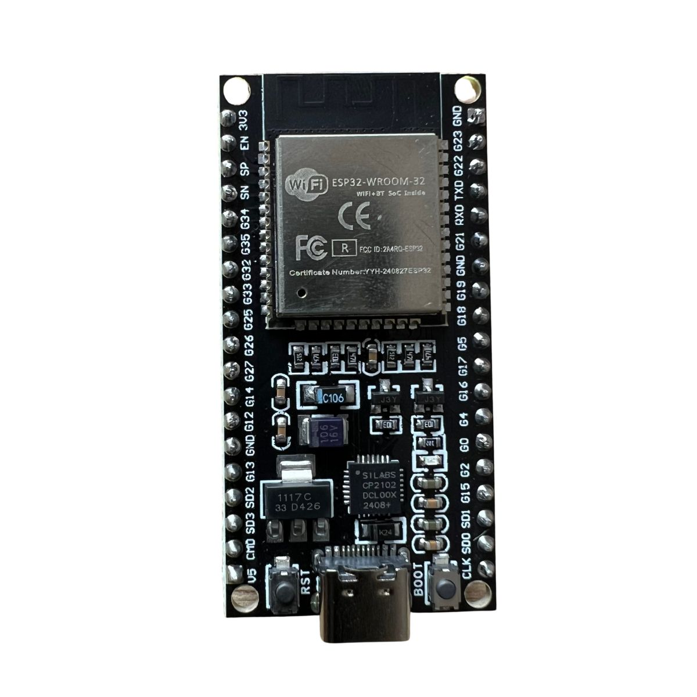
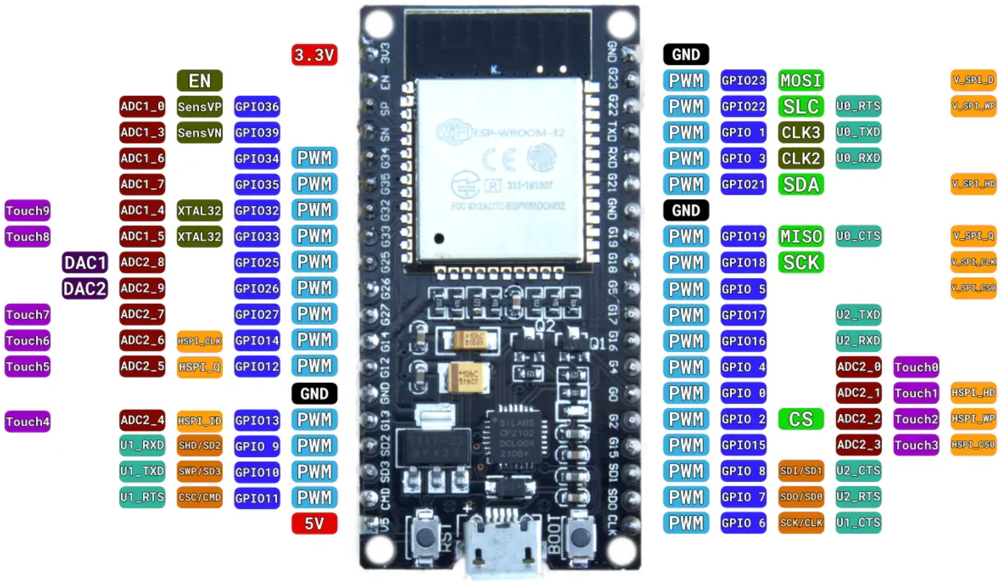

# Proyecto Educativo con Microcontroladores Espressif (ESP32)

Este repositorio está diseñado como una guía práctica para el aprendizaje de microcontroladores modernos, orientado especialmente a **estudiantes de física** interesados en aplicar sus conocimientos en proyectos reales de instrumentación, adquisición de datos, control automático y sistemas embebidos.

---

## ¿Qué es Espressif?

**Espressif Systems** es una empresa líder en el diseño de semiconductores, reconocida por sus microcontroladores **de bajo costo**, **alto rendimiento** y **conectividad integrada**, como el **ESP8266**, **ESP32**, y sus variantes más recientes (**ESP32-S3**, **ESP32-C3**, etc.).

Sus productos se destacan por ofrecer:
- **Wi-Fi**, **Bluetooth Clásico** y **Bluetooth Low Energy (BLE)** integrados.
- Capacidades avanzadas de procesamiento y eficiencia energética.
- Flexibilidad en su programación mediante distintos frameworks.

Estas características los hacen ideales para aplicaciones como:
- **Internet de las Cosas (IoT)**
- **Domótica y automatización**
- **Prototipado rápido**
- **Sistemas de medición y control**

---

## ¿Por qué es importante aprender a usar los microcontroladores Espressif?

Aprender sobre esta familia de microcontroladores ofrece múltiples beneficios tanto en el ámbito educativo como profesional:

- **Conectividad nativa**: No se requiere hardware adicional para conectarse a redes Wi-Fi o dispositivos Bluetooth.
- **Económicos y accesibles**: Perfectos para estudiantes, makers y proyectos de bajo presupuesto.
- **Amplia comunidad**: Miles de recursos, foros, bibliotecas y ejemplos disponibles en línea.
- **Flexibilidad en el desarrollo**:
  - **ESP-IDF**: Framework oficial de Espressif, potente y de bajo nivel.
  - **Arduino**: Más accesible para principiantes.
  - **PlatformIO**: Entorno de desarrollo moderno, multiplataforma y extensible.
- **Uso en la industria**: Estos microcontroladores son utilizados en productos comerciales y soluciones IoT a gran escala.

---

## ¿Qué contiene este repositorio?

Este repositorio está pensado como una plataforma educativa que combina **física experimental** con **tecnología embebida**, e incluye:

- Ejemplos de código para lectura de sensores y control de actuadores.
- Proyectos de adquisición y análisis de datos físicos (temperatura, aceleración, voltaje, etc.).
- Prácticas de laboratorio interactivas usando el ESP32.
- Comunicación inalámbrica y automatización con redes Wi-Fi o BLE.
- Aplicaciones de la física como instrumentación, medición, control y simulación.

---

## Entorno de desarrollo recomendado

Usamos **[PlatformIO](https://platformio.org/)** sobre **[Visual Studio Code](https://code.visualstudio.com/)** por sus ventajas:

- Integración moderna y fácil de usar.
- Gestión automática de dependencias y bibliotecas.
- Soporte nativo para múltiples placas, incluyendo todas las variantes de ESP32.
- Herramientas de depuración, simulación y monitoreo en tiempo real.

---

## Microcontrolador utilizado

Este repositorio está optimizado para el módulo **ESP32-WROOM-32**, uno de los más populares de la familia ESP32.



---

## Pinout de referencia

El siguiente diagrama muestra la distribución de pines del ESP32-WROOM-32. Es útil para identificar conexiones para sensores, actuadores y comunicación.



---

## Requisitos para empezar

1. **Visual Studio Code** instalado: [Descargar aquí](https://code.visualstudio.com/)
2. **Extensión PlatformIO** para VSCode: Instalable desde la barra de extensiones.
3. Cable USB para conectar el ESP32 a tu PC.
4. Este repositorio clonado en tu equipo:
   ```bash
   git clone https://github.com/JBalsells/Espressif.git
   cd Esspressif

