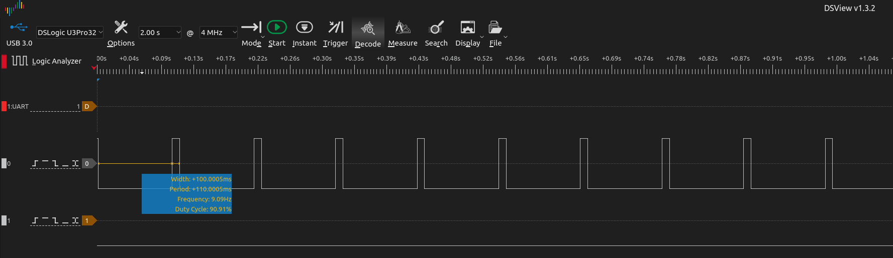
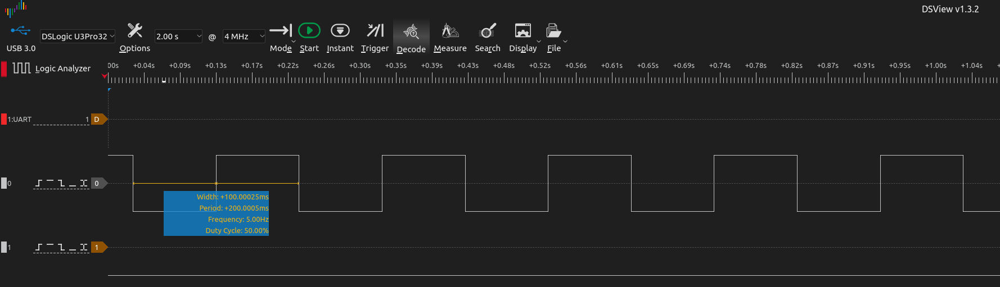
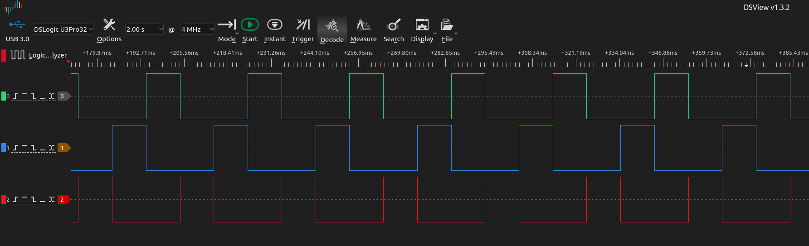

# Explicación paso a paso: Parpadeo de LED con ESP32 usando ESP-IDF

Este archivo describe detalladamente el funcionamiento de un programa que parpadea un LED utilizando el framework **ESP-IDF** de Espressif. El programa configura un pin GPIO como salida, y enciende y apaga un LED en intervalos definidos usando funciones de FreeRTOS. El lenguaje principal que se utiliza en ESP-IDF (Espressif IoT Development Framework) es C, aunque también puedes usar C++ si se configura adecuadamente.

---

## Partes principales de un programa en C
1. **Directivas de Preprocesador** 
Se colocan al inicio del archivo y se usan para:
- Incluir bibliotecas estándar o propias (`#include`)
- Definir constantes (`#define`)
    ```c
    #include <stdio.h>       // Biblioteca estándar de entrada/salida
    #define PI 3.14159       // Constante simbólica
    ```

2. **Declaraciones Globales**
Variables y prototipos de funciones que estarán disponibles en todo el archivo.
    ```c
    int sumar(int a, int b);      // Prototipo de función
    int contador_global = 0;      // Variable global
    ```
3. **Función Principal**
Es el punto de entrada del programa. Aquí comienza la ejecución del código.
    ```c
    int main(void) {
        int resultado = sumar(5, 3);      // Llamada a función
        printf("Resultado: %d\n", resultado);
        return 0;                         // Fin del programa
    }
    ```

4. **Funciones Auxiliares**
Sirven para organizar el código y evitar la repetición. Se pueden definir después de main().
    ```c
    int sumar(int a, int b) {
        return a + b;
    }
    ```

5. **Comentarios**
No afectan la ejecución del programa, pero ayudan a entender el código.
    ```c
    // Comentario de una línea

    /*
    Comentario
    de varias líneas
    */
    ```

---

## Código para generación de una onda cuadrada

```c
#include <stdio.h>
#include "freertos/FreeRTOS.h"
#include "freertos/task.h"
#include "driver/gpio.h"

#define BLINK_GPIO GPIO_NUM_2  // ¡Cambiar a un pin válido como 2, 5, etc!

void app_main(void)
{
    gpio_set_direction(BLINK_GPIO, GPIO_MODE_OUTPUT);

    while (1) {
        gpio_set_level(BLINK_GPIO, 1);
        vTaskDelay(pdMS_TO_TICKS(10));

        gpio_set_level(BLINK_GPIO, 0);
        vTaskDelay(pdMS_TO_TICKS(100));
    }
}
```


## Análisis detallado del código (paso a paso)

1. **`#include <stdio.h>`**  
   Importa la biblioteca estándar de C que permite utilizar funciones como `printf()`.  
   Aunque no se utiliza directamente en este ejemplo, es útil para depuración.

2. **`#include "freertos/FreeRTOS.h"`**  
   Incluye las definiciones básicas del sistema operativo FreeRTOS, el núcleo multitarea que utiliza ESP-IDF.

3. **`#include "freertos/task.h"`**  
   Proporciona funciones para trabajar con tareas (threads) en FreeRTOS.  
   Se utiliza aquí para la función `vTaskDelay()`, que implementa pausas sin bloquear el sistema.

4. **`#include "driver/gpio.h"`**  
   Incluye las funciones necesarias para controlar los pines GPIO del ESP32.  
   Permite configurar pines como entrada/salida y cambiar su estado lógico.

5. **`#define BLINK_GPIO GPIO_NUM_2`**  
   Define una constante llamada `BLINK_GPIO` que representa el pin GPIO número 2 del ESP32.  
   Este valor puede cambiarse fácilmente si se desea utilizar otro pin.

6. **`void app_main(void)`**  
   Esta es la función principal del programa.  
   En ESP-IDF, reemplaza a `main()` en C tradicional y se ejecuta al finalizar la inicialización del sistema.

7. **`gpio_set_direction(BLINK_GPIO, GPIO_MODE_OUTPUT);`**  
   Configura el pin especificado (`BLINK_GPIO`) como una salida digital.  
   Esto permite enviar señales desde el ESP32 hacia otros componentes (como un LED).

8. **`while (1)`**  
   Inicia un bucle infinito. En sistemas embebidos, esto es común para ejecutar una lógica continua.

9. **`gpio_set_level(BLINK_GPIO, 1);`**  
   Establece el pin en **nivel alto** (3.3V), lo que enciende el LED.

10. **`vTaskDelay(pdMS_TO_TICKS(10));`**  
    Pausa la tarea actual durante 10 milisegundos sin bloquear el resto del sistema.  
    - `vTaskDelay()` es una función de FreeRTOS para retardos no bloqueantes.  
    - `pdMS_TO_TICKS()` convierte milisegundos a "ticks" del sistema.

11. **`gpio_set_level(BLINK_GPIO, 0);`**  
    Establece el pin en **nivel bajo** (0V), apagando el LED.

12. **`vTaskDelay(pdMS_TO_TICKS(100));`**  
    Espera 100 milisegundos antes de repetir el ciclo, generando así el parpadeo visible.

---


## Visualización en Analizador Lógico


Si cambiamos uno de los tiempos que aparecen en el código, específicamente los 10 ms por 100 ms, tendríamos una señal de la siguiente manera:




## Generación de Tres Señales Cuadradas Desfasadas 120° con ESP32

En este código se generan **tres señales cuadradas** desfasadas 120 grados entre sí en los pines **GPIO0**, **GPIO2** y **GPIO4**. Se utiliza una función llamada `generate_three_phase_signal()` que enciende secuencialmente tres salidas digitales para simular un sistema trifásico. Cada fase permanece encendida durante 1/3 del periodo total, creando un desfase de 120° entre ellas.

Este patrón es útil para:
- Simular un sistema trifásico básico.
- Control básico de motores trifásicos (solo a nivel educativo o de prueba).
- Visualización de secuencia de fases con LEDs.

### Estructura del Código

```c
#include <stdio.h>
#include "freertos/FreeRTOS.h"
#include "freertos/task.h"
#include "driver/gpio.h"

// Pines de salida
#define PHASE_A GPIO_NUM_0
#define PHASE_B GPIO_NUM_2
#define PHASE_C GPIO_NUM_4

// Duración total de un ciclo (en milisegundos)
#define CYCLE_TIME_MS 30  // 30ms = ~33.3Hz
#define PHASE_DELAY_MS (CYCLE_TIME_MS / 3)

// Función que genera 3 señales cuadradas desfasadas 120°
void generate_three_phase_signal(void)
{
    // Configurar los pines como salida
    gpio_set_direction(PHASE_A, GPIO_MODE_OUTPUT);
    gpio_set_direction(PHASE_B, GPIO_MODE_OUTPUT);
    gpio_set_direction(PHASE_C, GPIO_MODE_OUTPUT);

    while (1) {
        // Fase A ON, otras OFF
        gpio_set_level(PHASE_A, 1);
        gpio_set_level(PHASE_B, 0);
        gpio_set_level(PHASE_C, 0);
        vTaskDelay(pdMS_TO_TICKS(PHASE_DELAY_MS));

        // Fase B ON, otras OFF
        gpio_set_level(PHASE_A, 0);
        gpio_set_level(PHASE_B, 1);
        gpio_set_level(PHASE_C, 0);
        vTaskDelay(pdMS_TO_TICKS(PHASE_DELAY_MS));

        // Fase C ON, otras OFF
        gpio_set_level(PHASE_A, 0);
        gpio_set_level(PHASE_B, 0);
        gpio_set_level(PHASE_C, 1);
        vTaskDelay(pdMS_TO_TICKS(PHASE_DELAY_MS));
    }
}

void app_main(void)
{
    generate_three_phase_signal();
}
```

## Análisis detallado del código (paso a paso)

1.  **`#define CYCLE_TIME_MS 30`** 
    **`#define PHASE_DELAY_MS (CYCLE_TIME_MS / 3)`**  
    Define los pines GPIO donde se emitirán las tres señales.

2.  **`void generate_three_phase_signal(void)`**  
    Lógica de la Función generate_three_phase_signal()
    Configura los pines como salidas.
    - Entra en un bucle infinito donde:
        - Activa PHASE_A y desactiva las otras dos durante 10 ms.
        - Activa PHASE_B durante otros 10 ms.
        - Activa PHASE_C por 10 ms.
        - Repite indefinidamente, manteniendo una secuencia trifásica.


3. **`#include "freertos/task.h"`**  
   Proporciona funciones para trabajar con tareas (threads) en FreeRTOS.  
   Se utiliza aquí para la función `vTaskDelay()`, que implementa pausas sin bloquear el sistema.

4. **`#include "driver/gpio.h"`**  
   Incluye las funciones necesarias para controlar los pines GPIO del ESP32.  
   Permite configurar pines como entrada/salida y cambiar su estado lógico.

5. **`#define BLINK_GPIO GPIO_NUM_2`**  
   Define una constante llamada `BLINK_GPIO` que representa el pin GPIO número 2 del ESP32.  
   Este valor puede cambiarse fácilmente si se desea utilizar otro pin.

6. **`void app_main(void)`**  
   Esta es la función principal del programa.  
   En ESP-IDF, reemplaza a `main()` en C tradicional y se ejecuta al finalizar la inicialización del sistema.

7. **`gpio_set_direction(BLINK_GPIO, GPIO_MODE_OUTPUT);`**  
   Configura el pin especificado (`BLINK_GPIO`) como una salida digital.  
   Esto permite enviar señales desde el ESP32 hacia otros componentes (como un LED).

8. **`while (1)`**  
   Inicia un bucle infinito. En sistemas embebidos, esto es común para ejecutar una lógica continua.

9. **`gpio_set_level(BLINK_GPIO, 1);`**  
   Establece el pin en **nivel alto** (3.3V), lo que enciende el LED.

10. **`vTaskDelay(pdMS_TO_TICKS(10));`**  
    Pausa la tarea actual durante 10 milisegundos sin bloquear el resto del sistema.  
    - `vTaskDelay()` es una función de FreeRTOS para retardos no bloqueantes.  
    - `pdMS_TO_TICKS()` convierte milisegundos a "ticks" del sistema.

